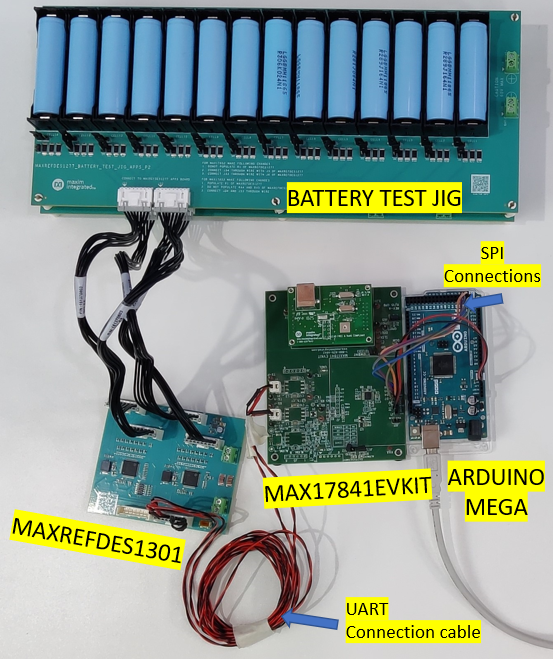
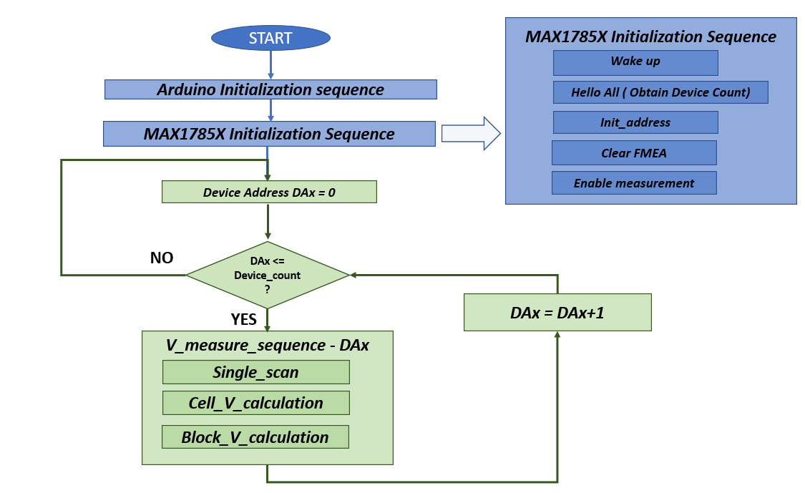
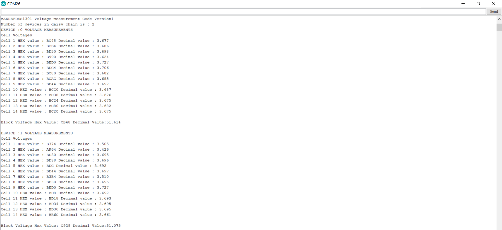

# MAXREFDES1301

The MAXREFDES1301 reference design enables quick evaluation of the MAX17852 and MAX17853 for 96V three-Wheeler BMS.
This reference design showcases the capabilities of the MAX17852 and MAX17853 in a daisy chain for the two individual 14-cell voltage measurements, pack voltage, pack current, temperature measurement, and passive cell balancing.

This firmware code example helps to measure Cell Voltages in daisy chain configuration.

### Hardware Set Up

Requirements:
- MAXREFDES1301
- MAX17841EVKIT board
- Battery test jig (Battery pack)
- General purpose micro controller (Arduino Mega 2560) for configuring and communication
- Communication cables and Jumper wire

The hardware connections for MAXREFDES1301 (MAX17852 and MAX17853) with MAX17841EVKIT, battery test jig is shown in image below.

SPI wire connection details from Arduino Mega 2560 to MAX17841EVKIT

| Arduino Pin Number | MAX17841EVKIT J1 connector | Wire Color |
| --------------------------- | ------------------ | ---------- |
| 53 | CS | Orange |
| 48 | SHDN | Brown |
| 52 | SCLK | Grey |
| 51 | DIN | Purple |
| 50 | DOUT | Blue |
| 5V (in Arduino) | DCIN | Red |
| GND (in Arduino) | AGND | Black |

### Software / Firmware Flow

**Software Download/Install**

Click the "Code" button and click "Download ZIP" above (from the main GITHUB repo page). After the download finishes, unzip the archive to the directory of choice. All the files needed can be found in the firmware directory.  From the Arduino IDE, open the MAXREFDES1301.ino file.

**Firmware Serial Output**

